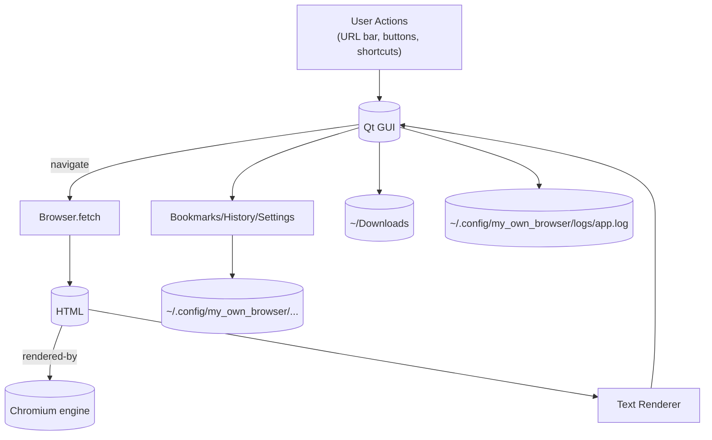
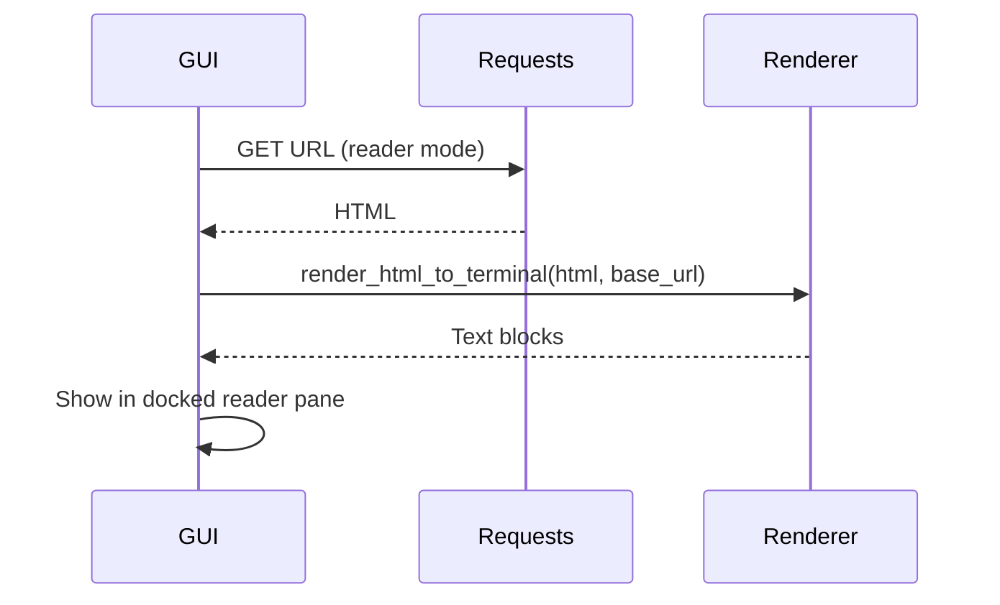

# My Own Browser – Architecture and Deep Dive

This document explains the project at both high and low levels: goals, modules, data flows, rendering logic, persistence, tests, and how everything fits together. It is intended to be educational and practical. PNG diagrams are generated into `my_own_browser/diagrams/`.

## Goals and Philosophy

- Build a small, understandable browser stack incrementally.
- Separate concerns: fetching, parsing, rendering, UI, persistence, and tooling.
- Everything evolves behind tests where practical.
- Offer two viewing modes:
  - Terminal-based reader (structure-first, text-only)
  - Full GUI via Qt WebEngine (Chromium) for modern HTML/CSS/JS

## Directory Overview

```
my_own_browser/
  ├── ARCHITECTURE.md         # This document
  ├── README.md               # Quick start and feature list
  ├── __init__.py             # Package export
  ├── bookmarks.py            # Persistent bookmarks
  ├── browser.py              # Core fetch + parse + history (toy)
  ├── cli.py                  # Terminal CLI (pretty/plain)
  ├── filter.py               # URL blocklist (ad/tracker patterns)
  ├── history.py              # Persistent history
  ├── logging_utils.py        # Rotating logs to config dir
  ├── qt_browser.py           # GUI app with tabs, downloads, persistence
  ├── renderer.py             # HTML→terminal text renderer (reader-friendly)
  ├── requirements.txt        # Runtime and test deps
  ├── screenshot.py           # Headless screenshots via Playwright
  ├── storage.py              # Cross-platform app paths + settings store
  └── tests/                  # Pytest test suite
```

## High-Level Dataflow

See `diagrams/architecture_flow.png`.



- The GUI path uses QtWebEngine for full modern rendering.
- The reader path uses our `renderer.py` to produce terminal-friendly text.
- Bookmarks/history/settings/logging persist under the user config directory.

## Reader Mode Flow

See `diagrams/reader_sequence.png`.



## Module-by-Module Deep Dive

### `browser.py` (Core fetcher)
- Defines `Browser` and `Page`.
- Responsibilities:
  - Normalize URLs (adds `https://` if missing).
  - Fetch via `requests.Session` with a custom user-agent.
  - Parse HTML with BeautifulSoup.
  - Extract absolute links via `urljoin`.
  - Maintain in-memory back/forward history.
- Not a full engine; used by the CLI and conceptually illustrates browser basics.

### `renderer.py` (Reader-friendly text rendering)
- Converts HTML to a structured text view for terminals/reader mode.
- Features:
  - Headings `h1..h6` → markdown-like `#`/`##`...
  - Paragraph reflow with word-wrapping and punctuation-aware spacing.
  - Lists (`ul/ol`) with bullets or numbers and proper indent wraps.
  - `pre` blocks preserved (hard-wrapped, no reflow of whitespace).
  - Inline images converted to tokens: `[IMG alt]` or `[IMG src]`.
  - Inline styles: `strong/b` → `**bold**`, `em/i` → `_italic_`, `code` → `` `code` ``.
  - Anchors replaced inline with numeric footnotes; URLs listed at the bottom.

### `qt_browser.py` (GUI)
- A Qt WebEngine-based browser:
  - Tabs, Back/Forward/Reload, URL bar with completion
  - Home button and homepage persistence
  - Downloads to `~/Downloads`
  - Persistent cookies/cache via a shared `QWebEngineProfile`
  - Bookmarks (+ dialog), History (+ dialog), Find-in-page
  - Reader mode (left dock) using the text renderer
  - Zoom controls (Ctrl++, Ctrl+-, Ctrl+0) persisted across runs
  - Basic URL blocklist to avoid common ad/tracker resources
- `QT_QPA_PLATFORM=xcb` suggested on Wayland systems.
- Command line args open URLs as initial tabs.

### `bookmarks.py`, `history.py`
- Long-lived JSON stores under `~/.config/my_own_browser/`.
- Bookmarks deduplicate by URL; history truncates to a max size.
- The GUI exposes dialogs for both with double-click-to-navigate.

### `filter.py` (URL blocklist)
- Simple pattern matcher (substring case-insensitive) over URLs.
- Defaults block common ad/tracker hosts/paths.
- User-editable at `~/.config/my_own_browser/blocklist.json`.

### `storage.py` (paths and settings)
- Determines platform-safe `config_dir`, `cache_dir`, `downloads_dir`.
- `settings.json` stores homepage and zoom factor.

### `logging_utils.py`
- Rotating logs in `~/.config/my_own_browser/logs/app.log`.
- Integrated into CLI, GUI, and screenshot tool.

### `cli.py`
- Terminal client for quick fetch-and-render:
  - Plain: show text content with simple wrap.
  - Pretty: use structured renderer for headings/lists/links/images.

### `screenshot.py`
- Headless page screenshots using Playwright’s Chromium.

## Persistence Layout

- Config: `~/.config/my_own_browser/`
  - `settings.json` (homepage, zoom factor)
  - `bookmarks.json`
  - `history.json`
  - `blocklist.json`
  - `logs/app.log` (rotating)
- Cache: `~/.cache/my_own_browser/` (Qt profile cache)
- Downloads: `~/Downloads/`

## Testing Strategy

- Unit tests (pytest) for renderer, browser normalization, storage utilities, bookmarks/history/filter, logging utilities, and screenshot arg parsing.
- GUI is exercised manually; non-GUI logic is testable and covered.

## Extensibility Roadmap

- Service worker/caching visualization panel (diagnostics)
- DevTools-style panes for headers/timings/cookies (read-only)
- Better adblock lists (uBO-compatible lists)
- Per-site settings
- Offline reading (save rendered text snapshots)
- Export to PDF (GUI or reader output)
- Keyboard-driven “Vim-like” navigation

## Usage Cheat Sheet

- GUI:
  - `QT_QPA_PLATFORM=xcb python -m my_own_browser.qt_browser https://example.com`
  - Shortcuts: Ctrl+L/T/W/R/B/H/F, Alt+Home, Ctrl+Shift+H/R, Ctrl++/Ctrl+-/Ctrl+0
- CLI pretty:
  - `python -m my_own_browser.cli --pretty https://example.com`
- Screenshot:
  - `python3 -m my_own_browser.screenshot --url https://example.com --out example.png --full-page`
