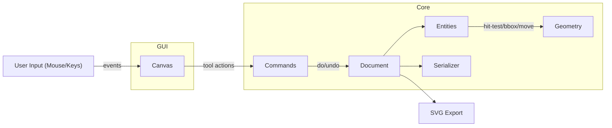
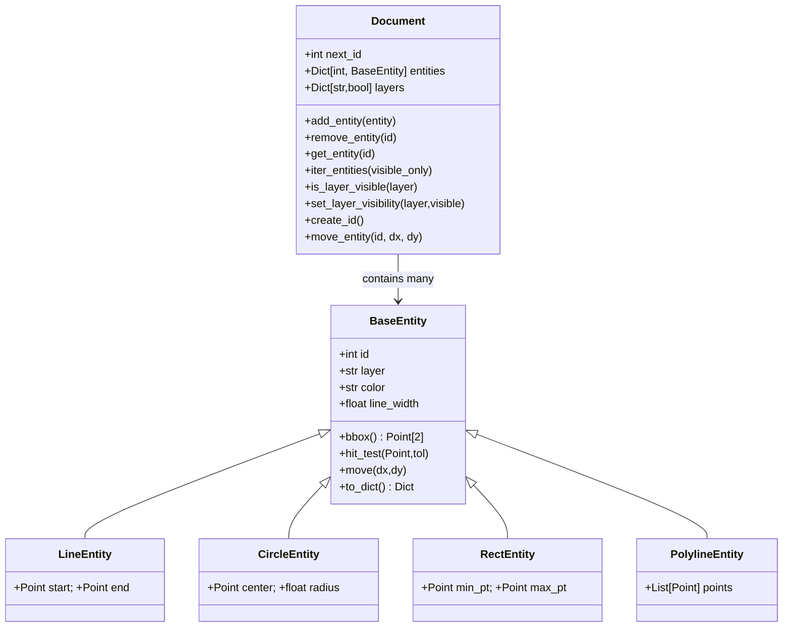
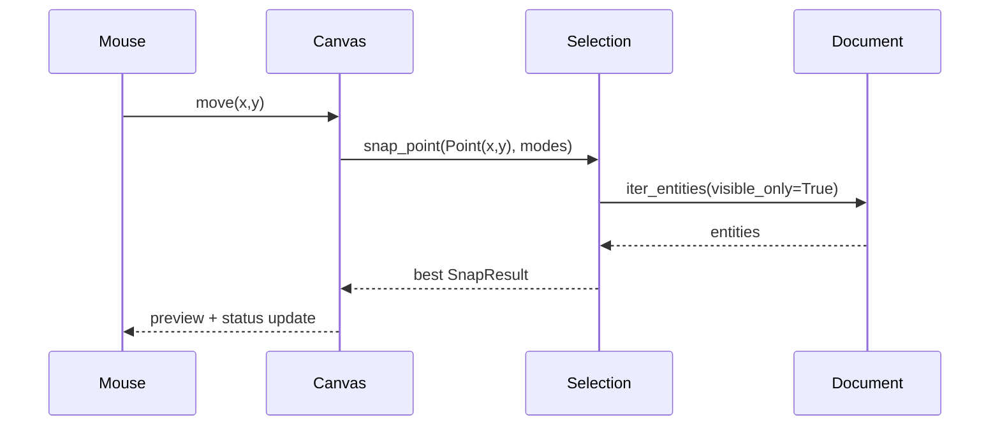
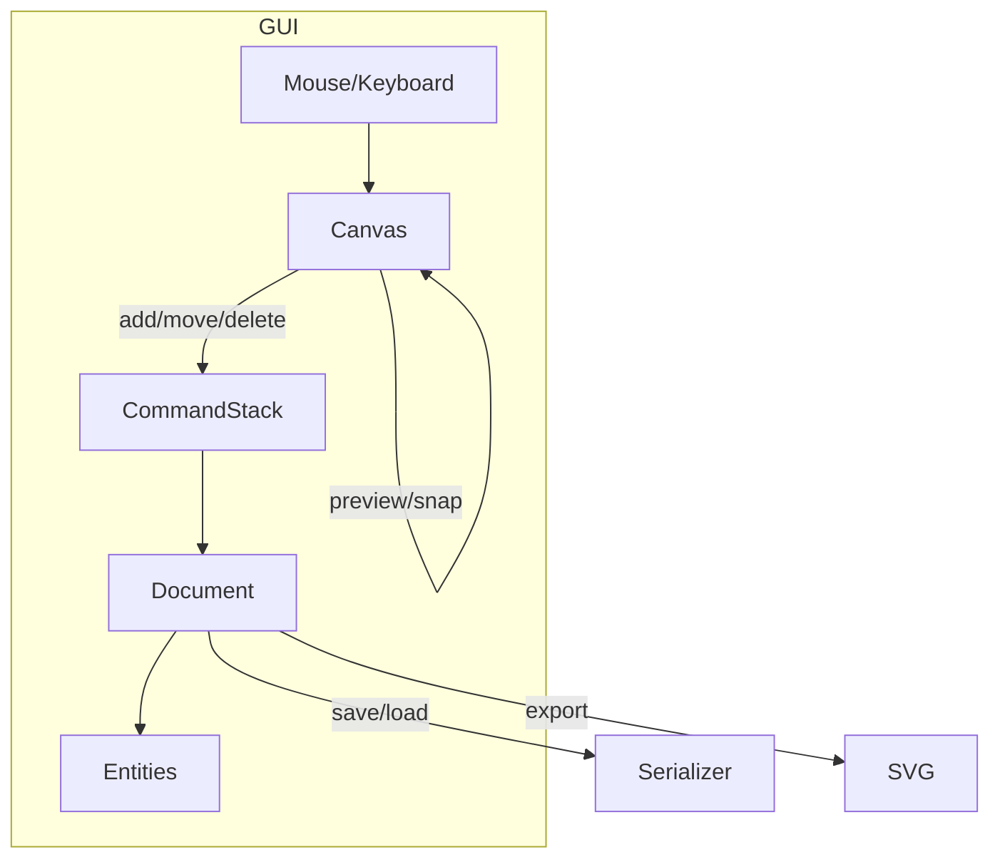

# My Own CAD Software – Deep Dive Architecture and Guide

This document explains the full architecture of the 2D CAD project in this folder, both high-level and low-level. It’s written as a learning resource: how things are structured, why, and how to extend it.

- Core modules are pure Python and fully unit-tested.
- The GUI is optional and imports PySide6 lazily.
- The app supports layers, undo/redo, snapping, a basic toolset, SVG export, and a small interactive viewer.


## Big Picture



- The GUI (`cad_app.py`) handles input, draws the scene, and delegates modeling actions to the core.
- The `Document` holds all `Entities` and layer visibility state.
- The `CommandStack` provides undo/redo.
- `selection.py` provides selection and snapping logic.
- `io/serializer.py` and `io/svg_export.py` provide persistence and export.


## Modules Overview

- `geometry.py`
  - `Point` dataclass, distance, bounding boxes, line segment proximity, grid snapping, nearest point on segment.
- `models/entities.py`
  - `BaseEntity` (id, layer, color, line_width) and concrete entities: `LineEntity`, `CircleEntity`, `RectEntity`, `PolylineEntity`.
  - Each entity: `bbox()`, `hit_test(point, tolerance)`, `move(dx, dy)`, and JSON (de)serialization.
- `models/document.py`
  - Holds entities, allocates incremental ids, manages layers and visibility, provides iteration and movement helpers.
- `models/command_stack.py`
  - A minimal undo/redo stack with `push_and_do`, `undo`, `redo`.
- `models/commands.py`
  - Concrete commands: `AddEntityCommand`, `RemoveEntityCommand`, `MoveEntityCommand`, `SetLayerVisibilityCommand`.
- `io/serializer.py`
  - JSON save/load for the whole document, including layers.
- `io/svg_export.py`
  - Converts the document to SVG, respecting color and line width.
- `selection.py`
  - Selection (`find_entity_at_point`) and snapping (`snap_point`) logic.
- `cad_app.py`
  - Optional GUI (PySide6) with pan/zoom, grid, snapping toggles, basic drawing tools, undo/redo, open/save.
- `tests/`
  - Unit tests covering geometry, entities/document, commands, layers, SVG, snapping.


## Data Model



Design choices:
- Entities own their render and hit-test essentials but not any GUI code.
- `line_width` and `color` live on entities, so all outputs (rendering/SVG) can use them.
- Layers are a simple visibility map `{layer_name: bool}` for now.


## Geometry and Hit-Testing

- `distance_between_points(a, b)`: Euclidean distance.
- `is_point_near_segment(p, a, b, tolerance)`: true if `p` is within `tolerance` of the segment `ab`.
- `bounding_box_for_segment/circle(...)`: returns `(min_point, max_point)` for spatial filtering.
- `snap_point_to_grid(p, grid_size)`: rounds a coordinate to a grid.
- `nearest_point_on_segment(p, a, b)`: used by snapping and distance-to-edge.

Entities implement:
- `bbox()` for visibility culling and interaction.
- `hit_test(p, tolerance)`: used in selection and selection proximity.
- `move(dx, dy)` to support commands and interactive transforms.


## Document and Layers

- Stores entities by id and manages `next_id`.
- Layer visibility APIs:
  - `is_layer_visible(layer)` and `set_layer_visibility(layer, visible)`.
  - `iter_entities(visible_only=True)` filters by the current layer visibility.
- `move_entity(id, dx, dy)` centralizes transforms.


## Commands and Undo/Redo

Two parts:
- `models/command_stack.py`: a stack cursor model: `push_and_do`, `undo`, `redo`.
- `models/commands.py`: command classes that modify `Document` on `do()` and revert on `undo()`.

Example command sequence:
1. User draws a line.
2. GUI builds a `LineEntity` and wraps it in `AddEntityCommand`.
3. `CommandStack.push_and_do(cmd)` executes and records it.
4. Undo/redo navigate the stack.


## Serialization and SVG

- JSON schema (simplified):

```json
{
  "next_id": 12,
  "layers": {"0": true, "A": false},
  "entities": [
    {
      "type": "LineEntity",
      "id": 1,
      "layer": "0",
      "color": "#000000",
      "line_width": 2.0,
      "start": {"x": 0, "y": 0},
      "end": {"x": 10, "y": 0}
    }
  ]
}
```

- SVG export converts entities to primitives with `stroke` and `stroke-width`.
- Polylines export to `<polyline points="..."/>`.


## Selection and Snapping

- `find_entity_at_point(document, p, tolerance, visible_only)`
  - Filters by layer visibility.
  - Ranks by id for determinism (no z-order yet).
- `snap_point(p, document, modes, tolerance, grid_size, visible_only)`
  - Collects candidates from active modes: `endpoint`, `midpoint`, `center`.
  - Picks the closest within `tolerance`.
  - Falls back to grid snapping or returns the raw point.




## GUI Architecture (PySide6)

- Lazy-imported inside `main()` so tests don’t need PySide6.
- Main classes inside `cad_app.py`:
  - `MainWindow(QMainWindow)` with toolbar, status bar, `Canvas` as central widget.
  - `Canvas(QWidget)` handles painting, tools, input, and coordinate transforms.
- Pan/zoom:
  - The canvas maintains `_origin` and `_scale`, applies them via `painter.translate` and `painter.scale`.
- Grid and snapping:
  - Grid is drawn in world space based on `grid_size`.
  - Snapping calls `selection.snap_point` using active toggles.
- Tools:
  - `select`, `line`, `circle`, `rect`, `polyline` with dashed previews.
  - Right-click drag moves a selected entity; release commits a `MoveEntityCommand`.
- Undo/redo and delete use the shared command stack.
- Open/Save:
  - Use JSON serializer and update the `Document` state accordingly.




## Testing Strategy

- `tests/test_geometry.py`: distances, segment hit-testing, bbox, grid snapping.
- `tests/test_document.py`: add/get/remove, id allocation.
- `tests/test_commands.py`: undo/redo flow.
- `tests/test_layers_and_svg.py`: layer visibility, serializer fidelity, SVG content.
- `tests/test_polyline_and_colors.py`: polyline behavior and color in SVG.
- `tests/test_selection_and_snapping.py`: selection proximity and snapping including visibility behavior.

All tests are pure-core; no GUI dependency.


## Extending the System

- Add a new entity type
  1. Create a dataclass in `models/entities.py` with fields.
  2. Implement `bbox`, `hit_test`, `move`, `to_dict` and extend `entity_from_dict`.
  3. Update SVG export and GUI painting.
  4. Add tests.

- Add a new tool
  1. Extend `Canvas` tool state and previews.
  2. Create commands that modify `Document`.
  3. Add toolbar action and shortcuts.

- Add a layer UI
  - Build a dock with a list of layers (checkbox per layer) and wire into `Document.set_layer_visibility`.

- Transformations
  - Add rotate/scale commands and handles; update entities accordingly.

- Constraints/Dimensions (future)
  - Introduce constraint objects (distance, parallel, perpendicular) and a solver step.


## File Reference

- `geometry.py`: Pure geometry helpers and snapping math.
- `models/entities.py`: Entity dataclasses and JSON (de)serialization.
- `models/document.py`: Document store, ids, layers, iteration, move.
- `models/command_stack.py`: Undo/redo.
- `models/commands.py`: Add/Remove/Move/SetLayerVisibility.
- `io/serializer.py`: JSON persistence.
- `io/svg_export.py`: SVG exporting with color and stroke width.
- `selection.py`: Selection and snapping.
- `cad_app.py`: Optional GUI.
- `tests/`: Comprehensive unit tests for the core.


## Design Rationale

- Separation of Concerns: Core logic is UI-agnostic and tested; GUI is a thin interactive layer.
- Progressive Complexity: Start with lines/circles/rectangles, add polylines, then scaling to constraints/dimensions later.
- Simplicity First: JSON and SVG for persistence and export keep dependencies minimal.


## Roadmap Ideas

- Layer management UI with colors/names.
- Selection box, multi-select, and transform gizmos.
- Rotate/scale commands and snapping to intersections.
- DXF import/export and richer SVG import.
- Dimensioning and constraint solving.

