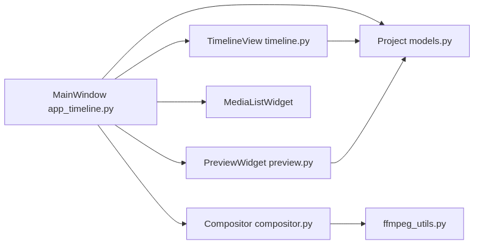
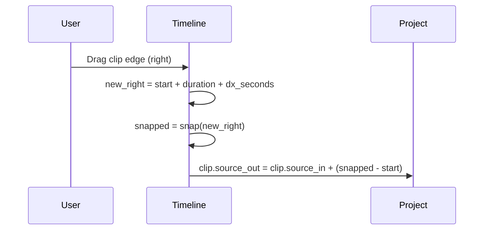
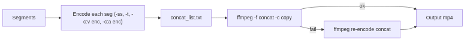

## Video Editor – Deep Dive Documentation

This document explains the architecture, data flow, design decisions, and implementation details of the `video_editor` project. It is meant to be educational from low-level mechanics to high-level structure, and to serve as a foundation for future contributions.

### Contents
- Architecture overview
- Major components and responsibilities
- Data model and timeline math
- Selection, snapping, zoom/pan, and interaction model
- Preview and playback
- Export pipeline (ffmpeg) and encoder probing
- Compositing model (top-most track)
- Project save/load and undo/redo history
- Drag and drop architecture (internal and OS)
- Testing strategy
- Shortcuts, UX patterns, and extensibility
- Performance considerations and known limitations
- Roadmap and next steps

---

### Architecture overview

At a high-level the app is a PySide6 desktop GUI built around three core domains:

- UI layer (Qt widgets):
  - `app_timeline.py`: Main window with media bin, preview, timeline, controls
  - `timeline.py`: Custom timeline widget for multi-track editing, selection, snapping, pans/zooms
  - `preview.py`: Frame-based preview widget

- Editing model:
  - `models.py`: Project, SourceMedia, Clip, and ProjectHistory (undo/redo)
  - Timeline semantics: absolute timeline seconds; mapping to source clip time

- Rendering/export:
  - `ffmpeg_utils.py`: Encoder probing, segment encoding, concat, and fallback re-encode
  - `compositor.py`: Converts a multi-track timeline into linear segments (top-most visible)




The UI widgets manipulate a `Project` instance. Export creates `EditSegment` objects from the project and delegates to ffmpeg.

---

### Major components and responsibilities

- `app_timeline.py` (Main window)
  - Media bin (add via dialog or OS drag-and-drop)
  - Preview surface
  - Timeline widget
  - Horizontal scrollbar, follow-playhead toggle, play/pause, time label
  - Shortcuts: split (S), duplicate (D), delete, snapping (G), follow (F)
  - Undo/redo via `ProjectHistory`

- `timeline.py` (TimelineView)
  - Ruler drawing, tracks background, grid lines
  - Clip rendering: position by `(clip.timeline_start - view_offset) / seconds_per_pixel`
  - Selection: single, Ctrl multi-select, marquee (Shift-drag on empty)
  - Interactions: move, edge-trim left/right, vertical drag to change track
  - Snapping: playhead and clip edges with a pixel-derived threshold
  - Pan/zoom: Ctrl+Wheel (zoom), Shift+Wheel (pan), middle mouse pan
  - Track header: lock/mute/visibility indicators and toggles
  - Internal drag/drop for placing media from bin onto timeline

- `preview.py` (PreviewWidget)
  - Frame-based preview using OpenCV (video only, audio is not yet played)
  - Maps playhead time to top-most visible clip and seeks frame by fps

- `models.py`
  - `SourceMedia`: probed fps, duration, width/height
  - `Clip`: source time `[source_in, source_out)` anchored at `timeline_start` on a track
  - `Project`: add/remove/duplicate clips, split clip, track states (lock/mute/visibility)
  - `ProjectHistory`: push, undo, redo using full snapshots (coalescing TBD)

- `compositor.py`
  - Linearization of timeline into ordered `EditSegment` spans using a coarse time grid and top-most visible track rule

- `ffmpeg_utils.py`
  - Encoder detection (`-encoders`), choose available codecs (prefers `libx264` + `aac`)
  - Segment export with `-ss` seek + re-encode, concat demuxer, fallback to re-encode if copy fails
  - Auto-append `.mp4` when extension omitted by user

---

### Data model and timeline math

- All timeline positions are in seconds.
- UI maps pixels ↔ seconds using `seconds_per_pixel` and `view_offset_seconds`.
  - Screen x coordinate for a clip start: `x = header_width + (timeline_start - view_offset_seconds) / seconds_per_pixel`
  - Converting mouse x to time: `t = (x - header_width) * seconds_per_pixel + view_offset_seconds`
- A clip covers `[timeline_start, timeline_end)`, where
  - `timeline_end = timeline_start + (source_out - source_in)`



Snapping uses candidates: playhead time, each clip’s start and end. A threshold is derived from `8 * seconds_per_pixel` so it scales with zoom.

---

### Selection, snapping, zoom/pan, and interaction model

- Selection
  - Single click selects a clip; Ctrl toggles membership for multi-select.
  - Marquee selection: Shift+drag on empty timeline; selects all intersecting clips.

- Move/Trim
  - Move: drags clip horizontally, snaps to nearby times; vertical drag changes track (unless locked).
  - Trim-left: adjusts `source_in` while keeping `timeline_start` fixed.
  - Trim-right: adjusts `source_out` while keeping `timeline_start` fixed.

- Zoom/Pan
  - Ctrl+Wheel to zoom; Shift+Wheel to pan; middle mouse drag to pan.
  - Horizontal slider mirrors and controls `view_offset_seconds`.
  - Follow-playhead (F) recenters the view around the playhead while playing.

---

### Preview and playback

- Preview is frame-based and uses OpenCV for simplicity; it displays top-most visible clip at the current playhead time.
- Playback timer (QTimer) advances the playhead and updates preview/time label. Audio is not yet played.
- Planned: use QtMultimedia for A/V playback while preserving frame-accurate still-frame seeking via OpenCV.

---

### Export pipeline (ffmpeg) and encoder probing

Export transforms the project into a list of segments and writes an mp4:

1) Export segments using `-ss` seek and re-encode to a consistent codec (prefers H.264/AAC) for robust concat.
2) Concat segments with the concat demuxer (`-f concat`) and `-c copy`.
3) If copy fails, fallback to re-encode the concat output (ensures success at the cost of time).
4) If the user omits the extension, `.mp4` is auto-appended.

Encoder probing uses `ffmpeg -encoders` to decide among `libx264`, `mpeg4`, `h264` for video and `aac`, `libmp3lame` for audio.



---

### Compositing model (top-most track)

The current compositor chooses the top-most visible clip at each time slice (coarse grid) and emits a contiguous segment when that top-most selection remains constant. It is a pragmatic MVP that ignores transitions/effects.

Planned: full per-track video/audio streams, transition graph, and audio mixdown.

---

### Project save/load and undo/redo history

- `Project.to_dict()` and `from_dict()` persist all sources, clips, track states, and ID counters.
- Save/load JSON to disk with `Project.save_project()` and `Project.load_project()`.
- `ProjectHistory` holds snapshots for undo/redo; it currently stores full snapshots and can be optimized by coalescing micro-edits and bounding memory.

---

### Drag and drop architecture

- Media bin accepts OS drag-and-drop (`MediaListWidget`) and in-app selections.
- Internal drag/drop supplies a custom MIME type to drop onto the timeline.
- Timeline `dropEvent` maps screen coordinates to timeline time (`view_offset_seconds` + `seconds_per_pixel`) and target track.

---

### Testing strategy

Tests live in `video_editor/tests/` and cover:
- Model operations: add/remove/split/duplicate clips, track lock/mute/visibility
- Compositor: segment total durations
- Export: extension auto-append behavior
- Project I/O: round-trip JSON
- Timeline properties: pan/zoom defaults
- Bulk delete and marquee selection defaults

Many tests generate tiny color videos with ffmpeg’s `lavfi` to avoid external files.

Run tests:
```bash
PYTHONPATH=. pytest -q video_editor/tests
```

---

### Shortcuts and UX patterns

- Space: Play/pause
- S: Split selected at playhead
- D: Duplicate selected
- Delete: Delete selected (or last added if none selected)
- G: Toggle snapping
- F: Toggle follow-playhead
- Ctrl+Wheel / + / −: Zoom; Shift+Wheel / middle mouse: Pan
- Marquee selection: Shift+drag empty area
- Track header click (or context actions): lock/mute/visibility

---

### Performance considerations and known limitations

- Preview uses OpenCV; audio is not played; playback frame timing is approximate.
- Export re-encodes segments for safety; it is slower but robust across formats.
- Compositing is top-most-only; no transitions or effects yet.
- Undo/redo uses full snapshots; memory can grow; needs coalescing and cap.
- Waveforms and clip thumbnails are not yet cached/generated.

---

### Roadmap and next steps

- Audio preview and waveform rendering per clip; volume/mute per track
- Transitions (crossfade) and text/image overlays
- Ripple/roll/slip/slide trim tools with visual guides
- Project autosave, crash recovery, relink missing media
- Hardware-accelerated export presets (NVENC/VAAPI) and progress/cancel dialog
- Clip thumbnails and media cache
- Context menus for clip/track with rich actions (duplicate/rename/lock/mute/visibility)

---

### Tips for contributors

- Keep UI rendering and model logic separate; treat `Project` as the source of truth.
- When adding timeline interactions, always convert through `seconds_per_pixel` and `view_offset_seconds`.
- Prefer adding unit tests for model changes; for UI-behavior, write small property tests (e.g., zoom/pan values).
- For export improvements, keep probing and fallback paths conservative.


